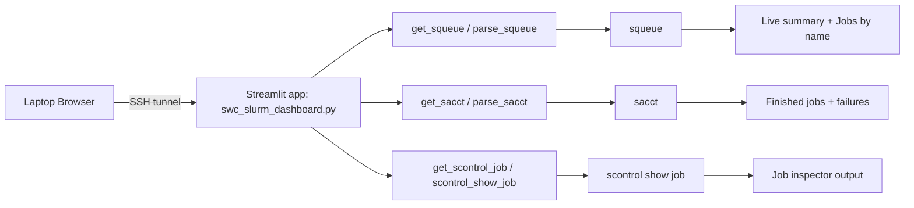

## Architecture

This project is deliberately small: a single Streamlit app that shells out to
Slurm, plus a helper script to start it safely on a login node.

### High-level picture

- **Process**: one Streamlit process running `swc_slurm_dashboard.py` on an HPC login
  node (e.g. `hpc-gw2`).
- **Data source**: read-only Slurm CLI commands (`squeue`, `sacct`,
  `scontrol show job`).
- **UI**: a single Streamlit app with three main tabs:
  - `Overview` – live queue summary, recent finished jobs, and failures.
  - `Job inspector` – detailed view of a single job via `scontrol`.
  - `Help` – documentation on how jobs / arrays / names map onto the dashboard.

Users normally:

1. Start the app on a login node via `run_dashboard.sh` (often in `tmux`).
2. Open an SSH tunnel from their laptop.
3. Visit `http://localhost:<LOCAL_PORT>` in a browser.

---

## Components

### 1. Startup script: `run_dashboard.sh`

**Responsibility**

- Start the Streamlit app with a sensible port and clear tunnel instructions.

**Key behavior**

- Picks a port:
  - If you pass a port: uses that directly.
  - Else: finds the first free port in `8501–8510` with a tiny Python snippet.
- Prints:
  - Hostname and chosen port.
  - A ready-to-copy SSH command:
    `ssh -J <user>@ssh.swc.ucl.ac.uk <user>@<host> -N -L <LOCAL_PORT>:127.0.0.1:<PORT>`
  - The browser URL to open: `http://localhost:<LOCAL_PORT>`.
- Runs:
  - `streamlit run swc_slurm_dashboard.py --server.port "$PORT" --server.address 0.0.0.0`

This script encodes the “official” way to start the portal and is the only
place you should need to touch for port / tunnelling conventions.

---

### 2. Streamlit app: `swc_slurm_dashboard.py`

`swc_slurm_dashboard.py` is structured into clear sections (in order):

1. **Styles and page config**
2. **Shell helpers**
3. **Slurm parsers**
4. **Cached wrappers**
5. **Summaries / aggregations**
6. **Sidebar (user + refresh)**
7. **Tabs** (`Overview`, `Job inspector`, `Help`)

#### 2.1 Styles & layout

- `st.set_page_config(...)`:
  - Title: `SWC Slurm Dashboard`.
  - Layout: wide; expanded sidebar.
- CSS injected via `st.markdown(..., unsafe_allow_html=True)`:
  - Section title color and typography.
  - Status colors:
    - RUNNING, WAITING, FAILED, DONE (match the legend).
  - Health banner:
    - OK (green), ATTENTION NEEDED (orange).
  - Subtle input focus ring (neutral, not “error red”).

This gives a consistent dark theme without depending on external CSS files.

#### 2.2 Shell helpers

- `sh(cmd: str) -> str`
  - Thin wrapper around `subprocess.check_output`.
  - Raises on non-zero exit.
- `safe_sh(cmd: str) -> str`
  - Calls `sh`, but catches errors and returns error text instead of raising.
  - Used everywhere Slurm commands are invoked so the UI can degrade
    gracefully if Slurm is misconfigured.

**Important**: only fixed-format Slurm commands ever reach `safe_sh`. The code
never concatenates free-form user input into arbitrary shell.

#### 2.3 Slurm parsers

Two main families:

- **Queue (live)** – `squeue`:
  - `parse_squeue(user: str) -> DataFrame`:
    - Tries `squeue --json` first (`_squeue_from_json`).
    - Falls back to pipe-delimited `squeue -o '%i|%T|%j|%M|%R|%E'`.
    - Returns a DataFrame with fixed columns: `JobID, State, Name, Time,
      Reason, Dependency`.
- **History (failures)** – `sacct`:
  - `parse_sacct(user: str, start: str) -> DataFrame`:
    - Tries `sacct --json` first (`_sacct_from_json`).
    - Falls back to `--parsable2` with a fixed column list.
    - Returns `SACCT_ALL_COLUMNS`:
      - `JobID, JobName, State, ExitCode, Elapsed, NodeList, MaxRSS,
        ReqMem, Timelimit, CPUTime, WorkDir, SubmitLine, Submit, Reason`.

Other helpers:

- `list_squeue_users()` – reads the distinct users currently in `squeue`,
  plus `$USER`, and returns a sorted list.
- `scontrol_show_job(job_id: str) -> str` – validates the job ID with a
  regex and returns raw `scontrol show job` output or an error message.

#### 2.4 Cached wrappers

To avoid hammering the scheduler:

- `@st.cache_data(ttl=...)` on:
  - `get_squeue_users()`
  - `get_squeue(user)`
  - `get_sacct(user, start)`
  - `get_live_by_name(df)`
  - `get_failures_by_name(dfh)`
  - `get_scontrol_job(job_id)`

The **Refresh now** button in the sidebar does a full refresh by calling
`st.cache_data.clear()` before rerunning, so you always get fresh data when
you ask for it.

#### 2.5 Summaries / aggregations

- `summarise_live_by_name(df)`:
  - Input: raw `squeue` DataFrame.
  - Groups by `Name`.
  - Computes per-name counts focused on the live queue: RUN, WAIT, TOTAL.
  - Chooses:
    - `SampleJobID`: prefers a RUNNING `JobID` if any (for arrays this is a
      single job array element such as `12345_0`), otherwise the last job in
      the group.
    - `ELAPSED`: time for a RUNNING job in the group, or `-`.
    - `NodeReason`: node name or scheduler reason, with a best-effort pick.
  - Derives a **Status** per name:
    - FAILED > RUNNING > various WAITING states > UNKNOWN.
  - Output columns:
    - `Name, SampleJobID, RUN, WAIT, TOTAL,
      ELAPSED, Status, NodeReason`.

- `summarise_failures_by_name(dfh)`:
  - Input: `sacct` history for a user since a start time.
  - Filters to failure-like states:
    - FAILED, OUT_OF_MEMORY, CANCELLED, TIMEOUT.
  - Groups by `JobName`:
    - `Count` = number of failing jobs with that name.
    - `Last*` fields from the most recent failing job (JobID, State,
      ExitCode, Elapsed, Node, MaxRSS, etc.).
  - Optionally includes `ReqMem`, `Timelimit`, `CPUTime`, `WorkDir`,
    `Reason` when present.

These two summaries are exactly what power the two main tables.

---

### 3. Sidebar

The sidebar manages:

1. **User selection**
   - `selected_user` from a `selectbox` backed by `get_squeue_users()`.
2. **Refresh control**
   - `last_manual_refresh_ts` stored in `st.session_state`.
   - A small `render_refresh_age(...)` helper shows
     `Elapsed since refresh: HH:MM:SS` in the sidebar.
   - **Refresh now** button:
     - Clears caches via `st.cache_data.clear()`.
     - Updates `last_manual_refresh_ts`.
     - Calls `st.rerun()`.

This keeps the user context and manual refresh behavior in a single, predictable place.

---

### 4. `Overview` tab

Rendered inside the `Overview` tab.

**Header + meta**

- Title: `SWC Slurm Dashboard`.
- Meta line: `User: <user> · Last updated: <UTC timestamp>`.

**Live summary**

- `df = get_squeue(selected_user)`.
- If empty:
  - Metrics = 0, info message “No jobs in queue.”
- Else:
  - Metrics:
    - TOTAL jobs
    - RUNNING jobs
    - WAITING jobs
    - DEP problems (DependencyNeverSatisfied count)
  - Health banner:
    - OK (green) if `dep_bad == 0`.
    - ATTENTION NEEDED (orange) otherwise.

**Jobs by name**

When queue isn’t empty:

1. Section title: `JOBS BY NAME`.
2. `How to read this` expander:
   - Explains:
     - Grouping by job name.
     - Meaning of each column.
     - Importance of `BLOCKED (dependency never satisfied)`.
     - Status color legend (RUNNING, WAITING, FAILED, DONE).
3. Table:
   - Data: `df_by_name = get_live_by_name(df)` → `df_display`.
   - Rendered with `st.dataframe(...)` and a style function that colors the
     **STATUS (summary)** column to match the legend.

**Finished jobs**

- Section title: `FINISHED JOBS (since: <date>)`.
- `How to read this` expander:
  - Explains:
    - The **since** date is the start of the history window, derived from the
      live queue:
      - It starts roughly when your longest-running current task started
        (based on the elapsed time reported by `squeue`), or
      - From the beginning of today (UTC) if nothing is running.
    - Only successful tasks are included (state contains `COMPLETED` and
      `ExitCode` starts with `0:`).
    - The table is split into:
      - **Related to running jobs** (jobs whose array job ID matches an array
        that currently has at least one RUNNING job).
      - **Other finished jobs** (all other successful tasks in the window).
    - Each row is one `JobID` from Slurm (which, for job arrays, may be a
      specific job array element such as `12345_0`), with its array-or-job
      identifier, name, state, exit code, elapsed time, and node list.
- Data flow:
  - A start time and label are derived from `squeue` via
    `derive_history_start_from_squeue(df)`.
  - `dfh_window = get_sacct(selected_user, start_time)`.
  - A filtered subset of successful tasks is rendered as two
    `st.dataframe(...)` tables (related vs other).

**Failures**

- Section title: `FAILURES (since: <date>)`.
- `How to read this` expander:
  - Explains:
    - The same history window as **Finished jobs** is used.
    - Included rows:
      - States matching `FAILED`, `CANCELLED`, `TIMEOUT`, `OUT_OF_MEMORY`, or
      - Any row with a non-zero `ExitCode`.
    - The table is split into:
      - **Related to running job names**.
      - **Other failures**.
    - Each row is grouped by `JobName` and includes:
      - `Count`, last failing `JobID` (for arrays this is a specific job array
        element such as `12345_0`), state, exit code, elapsed time, node,
        `MaxRSS`, and optional resource columns (e.g. `ReqMem`, `Timelimit`,
        `CPUTime`, `WorkDir`) when present.
- Data flow:
  - `df_fail_all = get_failures_by_name(dfh_window)`.
  - Two `st.dataframe(...)` tables are rendered (related vs other).

---

### 5. `Job inspector` tab

Rendered inside the `Job inspector` tab.

---

### 6. `Help` tab

Rendered inside the `Help` tab.

- Displays the contents of `SLURM_DASHBOARD_HELP.md` using `st.markdown`.
- Explains how SLURM jobs / arrays / job names map onto:
  - **SUMMARY**
  - **QUEUED JOBS**
  - **FINISHED JOBS**
  - **FAILURES**

**Purpose**

- Let the user run `scontrol show job <JobID>` via a simple form, and see raw
  Slurm output for that job.

**UI**

- Help text explaining what the tool does and how to use it.
- Two columns:
  - Left:
    - Free text input: `Job ID` (e.g. 12345 or 12345_3).
  - Right:
    - Dropdown: `Or pick from your queue` using live `get_squeue(...)`.
- Resolution:
  - Chooses the picked ID if present, otherwise the typed ID.
  - Validates ID via `get_scontrol_job(job_id)`.

**Output**

- If a valid job ID is provided:
  - `st.code(..., language="text")` showing raw `scontrol` output.
- Otherwise:
  - Info message asking for a job ID.

The Job inspector is intentionally thin; it delegates all Slurm semantics to
`scontrol`.

---

## Security / deployment assumptions

- Intended deployment is a trusted HPC environment:
  - App runs on a login node.
  - Users access it via SSH tunnelling from their own machines.
- The portal is read-only by design:
  - It calls `squeue`, `sacct`, and `scontrol show job`.
  - It never submits, cancels, or modifies jobs.
- The app is not designed as a public internet service:
  - Keep access scoped to your cluster/network policies.
  - Prefer SSH forwarding over exposing Streamlit directly.

## Known limitations

- Depends on local Slurm CLI tooling and permissions:
  - If `squeue`, `sacct`, or `scontrol` are unavailable/misconfigured,
    sections may show empty/error outputs.
- Data freshness is cache-based:
  - `@st.cache_data` TTLs reduce scheduler load but can delay updates.
  - **Refresh now** clears cached data and reruns immediately.
- Parsing depends on Slurm output behavior:
  - JSON is preferred when available; legacy fallback parsers are best-effort.
- `Refresh now` clears Streamlit data caches for this app session:
  - This is intentional for manual "fetch latest now" behavior.

---

## Extending the app

Some natural extension points:

- **New summary tables**:
  - For example, grouping by **user**, **partition**, or **node**:
    - Mirror `summarise_live_by_name` with a different `groupby`.
- **Additional history views**:
  - Configurable `start` for `get_sacct` (e.g. “last 7 days”).
- **Job detail panels**:
  - When clicking a row in `JOBS BY NAME`, pre-fill the Job inspector with its
    `SAMPLE JOB ID`.

The current structure (parsers → cached wrappers → summarizers → pages) is
meant to keep these additions straightforward.