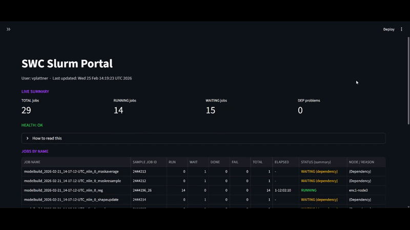

## SWC Slurm Dashboard

Streamlit dashboard for monitoring SLURM jobs: live queue, historic failures, and a job inspector (`scontrol show job`). The app is **read‑only** and never submits or cancels jobs.



> **Note:** 
> This project was built with a lot of AI assistance. Feedback, bug reports, and improvement suggestions are very welcome.

## Quick start (SWC)

### Setup (do once)

- **1. Clone the repo on HPC login node (`hpc-gw2`)**
  ```bash
  git clone git@github.com:LIMLabSWC/slurm_dashboard.git
  cd slurm_dashboard
  ```

- **2. Create a micromamba env and install requirements**
  ```bash
  micromamba create -n swc-slurm-dashboard-env python=3.11 pip -y
  micromamba activate swc-slurm-dashboard-env
  pip install -r requirements.txt
  ```

### Usage

- **1. Start the portal (tmux optional but recommended)**
  - First, SSH to the login node (for example, `hpc-gw2`).
  - Run these commands:
  ```bash
  tmux new -s slurm_dashboard
  cd slurm_dashboard
  micromamba activate swc-slurm-dashboard-env
  ./run_dashboard.sh            # script prints the chosen PORT and SSH tunnel command
  ```

- **2. From your laptop: open a tunnel to the HPC login node**
  - Copy the `ssh -N -J ... -L ...` command printed by `run_dashboard.sh` and run it in a terminal on your laptop.  
  
  
  > **Note:**
  >Keep this tunnel terminal open while you use the dashboard.

- **3. On your laptop: view in the browser**
  - Open the `http://localhost:...` URL printed by `run_dashboard.sh`.
  - If needed, `<LOCAL_PORT>` is the first number in `-L <LOCAL_PORT>:127.0.0.1:<PORT>`.  
  
  
  > **Note:**
  >If the page is blank at first, wait a few seconds and reload the browser. It can take a moment for the tunnel and portal to become ready.


## Advanced / Troubleshooting

- **Where the app runs**
  - At SWC, the portal runs **on an HPC login node (e.g. `hpc-gw2`) inside a tmux session**, so it survives SSH disconnects.
- **Ports**
  ```bash
  # Let the script choose the first free port in 8501–8510:
  ./run_dashboard.sh

  # Or specify a port explicitly:
  ./run_dashboard.sh 8765
  # then tunnel with: ssh -L 8765:localhost:8765 <user>@ssh.swc.ucl.ac.uk
  # and open http://localhost:8765
  ```
- **Direct Streamlit invocation (advanced)**
  ```bash
  streamlit run swc_slurm_dashboard.py --server.port 8501 --server.address 0.0.0.0
  ```
- **Other SSH setups**
  - **Jump host example (SWC ssh.swc.ucl.ac.uk → sgw2)**:
    ```bash
    ssh -J <user>@ssh.swc.ucl.ac.uk \
        -L 18501:127.0.0.1:8501 \
        <user>@sgw2 \
        -N
    ```
    then open `http://localhost:18501` in your browser.
  - **Phone**: use the same tunnel commands from a phone SSH app (with local port forwarding), then open `http://localhost:<port>` in the phone browser.

## Safety

The portal only runs **read‑only** Slurm commands: `squeue`, `sacct`, `scontrol show job`. It **never** runs `sbatch`, `salloc`, `scancel`, or any other command that would submit or modify jobs.